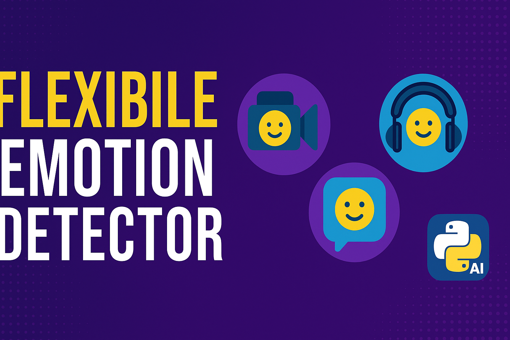

# 🎭 Flexible Emotion Detector

[](https://www.python.org/)
[](https://streamlit.io/)
[](https://github.com/Uvais5/Flexible-Emotion-Detector/blob/master/LICENSE)
[](https://github.com/Uvais5/Flexible-Emotion-Detector)
[](https://github.com/Uvais5/Flexible-Emotion-Detector/stargazers)

Detect human emotions from **video 🎦**, **audio 🎧**, or **text 💬** — all in one flexible and interactive Streamlit app.

<p align="center">
  
</p>

---

## 🧩 Project Overview

Flexible Emotion Detector is a **multi-modal emotion recognition system** that adapts to different input types — video, audio, or text. It extracts emotional cues from:

- **Facial expressions** in videos  
- **Speech signals** in audio  
- **Words and phrases** in spoken or written text  

This tool integrates deep learning models for vision, audio, and NLP to provide a unified emotion prediction experience. It’s ideal for applications like affective computing, mood analysis, and emotional insight extraction in human–AI interaction.

---

## 🎬 Project Demo

<div align="center">
  <a href="https://youtu.be/kZP5kroO56Q?si=IAgaUtPpsjqIgkni" target="_blank">
    
  </a>
  <br>
  <strong><a href="https://www.youtube.com/watch?v=DF53aO3G2jQ&ab_channel=uvaissaifi" target="_blank">▶️ Watch: Flexible Emotion Detector</a></strong>
  <p>Video by Data Science Solutions</p>
</div>

> ⚠️ GitHub does not support embedding actual YouTube videos. Clicking the image will open the video in a new tab.


---

## 💡 Problem It Solves

- ✅ Users often don’t have the same input format — some only provide audio, some video, others just typed or spoken text.  
- ✅ Most emotion models work on only **one modality**.  
- ✅ This system adapts to **whatever input is available** — making it useful in real-world settings like:
  - Virtual therapy & mood tracking
  - Voice assistants
  - Social media content analysis
  - Human behavior research

---

## ✨ Key Features

| Modality   | What Happens                                                | Model                           |
|------------|-------------------------------------------------------------|----------------------------------|
| **Face**   | Detects most frequent facial emotion from video frames      | CNN (FER-2013)                  |
| **Speech** | Classifies vocal tone using MFCC + LSTM                     | Audio model (`.h5`)             |
| **Text**   | Transcribes audio and detects text emotion via NLP pipeline | Hugging Face RoBERTa (EmoNLP)   |

🎛️ Toggle any combination of modalities on/off from the Streamlit sidebar.  
📂 Accepts **MP4 (video)**, **WAV/MP3 (audio)**, or **typed/pasted text**.

---

## 🚀 Quick Start (local)

```bash
# clone
git clone https://github.com/Uvais5/Flexible-Emotion-Detector.git
cd Flexible-Emotion-Detector

# create virtual environment & install dependencies
python -m venv venv
source venv/bin/activate          # On Windows: venv\Scripts\activate
pip install -r requirements.txt

# launch the app
streamlit run new_main.py
